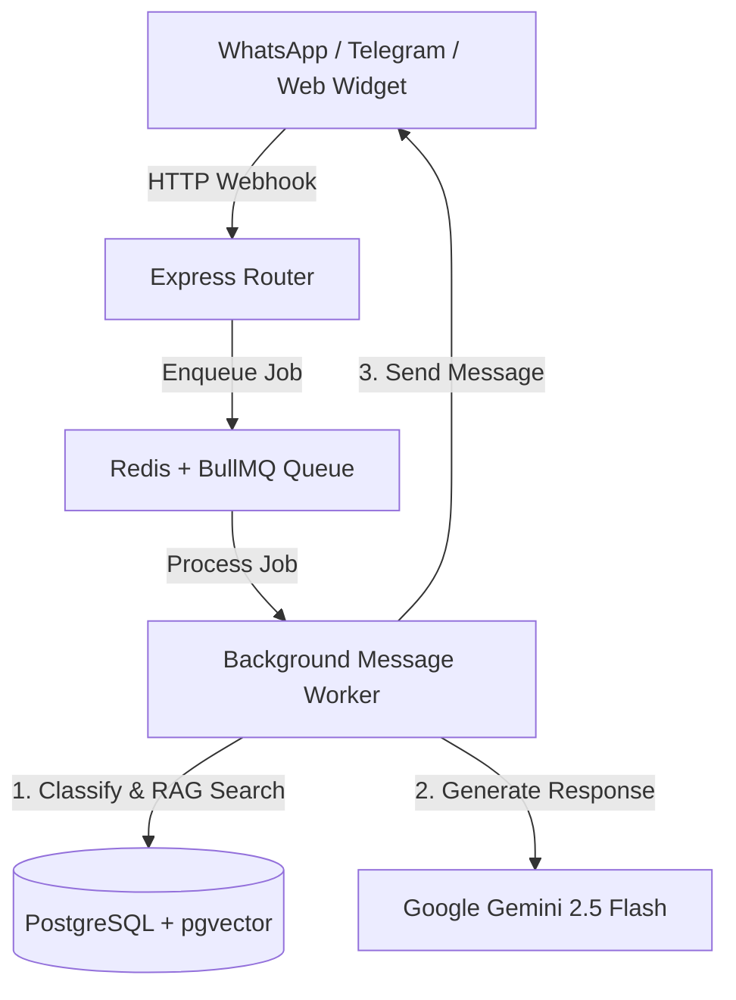

# 📐 Plano Técnico de Arquitetura: Mini-Assistant

## 1. Arquitetura de Componentes

---

## 2. Estrutura de Dados (Prisma Schema)
- `Client`: Entidade principal da empresa assinante.
- `KnowledgeChunk`: Tabela vetorial RAG com índice HNSW/pgvector.
- `EndUser` & `Message`: Histórico de conversas por canal e usuário.
- `Classification`: Cache vetorial de classificações prévias.

---

## 3. Estratégia de Implantação e CI/CD
- **Docker Compose**: Containerização unificada contendo API Node.js, Redis e PostgreSQL com suporte a `pgvector`.
- **GitHub Actions**: Build automático da imagem Docker publicada no GitHub Container Registry (GHCR).
