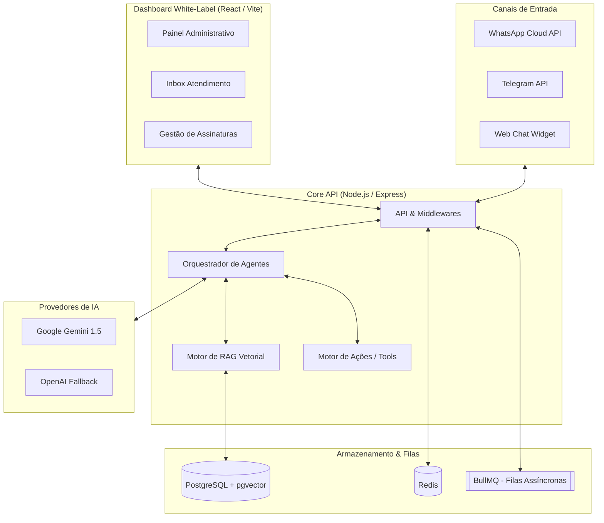
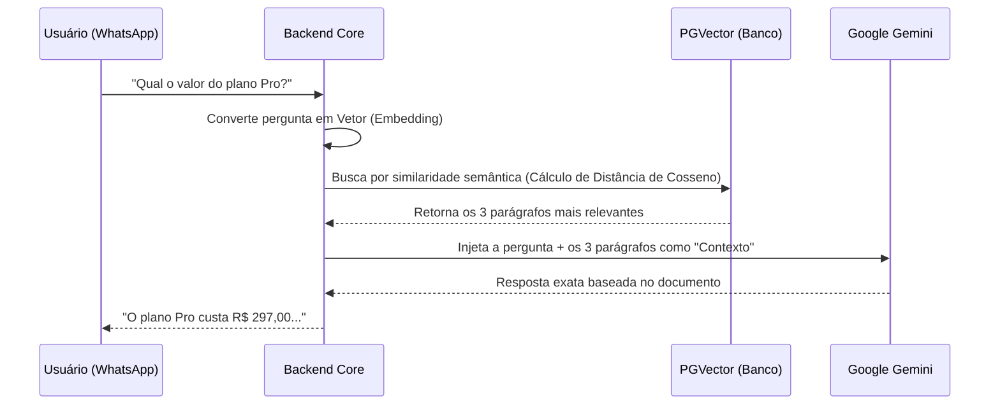

# 🚀 Mini-Assistant: Plataforma SaaS de Agentes de IA Omnichannel

Este documento apresenta uma visão técnica e estratégica detalhada do **Mini-Assistant**, uma plataforma SaaS (Software as a Service) White-Label projetada para criar, orquestrar e gerenciar Agentes de Inteligência Artificial autônomos. 

A plataforma não é apenas um "chatbot", mas sim um ecossistema corporativo completo que integra bases de conhecimento privadas (RAG), tomada de decisão autônoma (Function Calling/Tool Use) e comunicação multicanal.

---

## 🎯 1. Proposta de Valor do Produto

O Mini-Assistant foi arquitetado para resolver o problema de escala no atendimento e na execução de tarefas operacionais. Ele permite que as empresas tenham seus próprios assistentes de IA que **pensam, consultam dados reais e executam ações**.

*   **Multi-Tenant (Múltiplos Inquilinos):** Uma única infraestrutura atende a múltiplos clientes de forma isolada e segura. Cada cliente tem seus próprios agentes, dados vetoriais, limites de uso e configurações.
*   **White-Label:** A interface administrativa (Dashboard) e o widget web podem ser personalizados com a marca do cliente final.
*   **Omnichannel Verdadeiro:** O cérebro da IA é centralizado, mas ele atende o cliente final simultaneamente no **WhatsApp (Cloud API Oficial)**, **Telegram** e **Web Chat Widget**.
*   **Handoff Humano:** Capacidade de pausar a IA automaticamente quando necessário, permitindo que um atendente humano assuma o controle da conversa através de um painel Inbox.

---

## 🏛️ 2. Arquitetura Geral do Sistema

A arquitetura foi desenhada para suportar alta concorrência e processamento assíncrono intensivo, utilizando as melhores práticas de microsserviços lógicos.

---

## 🧠 3. Motor RAG (Retrieval-Augmented Generation)

Para que a IA não sofra com alucinações e responda com base nos dados exatos da empresa (Preços, Manuais, FAQs), o sistema implementa um pipeline **RAG de última geração**.

### Como funciona o fluxo de ingestão:
1.  **Upload:** O cliente faz upload de PDFs, planilhas CSV, ou informa uma URL de um site.
2.  **Scraping & Parsing:** O sistema usa bibliotecas avançadas (como `Puppeteer` para sites e `pdf-parse`) para extrair o texto limpo.
3.  **Chunking:** O texto é fatiado inteligentemente, respeitando quebras de parágrafos e limite de tokens.
4.  **Vetorização:** Cada "chunk" (fatia de texto) é transformado em uma matriz numérica (Embedding) usando a API de Embeddings e salvo no **PostgreSQL utilizando a extensão `pgvector`**.

### Como funciona a busca (Quando o usuário faz uma pergunta):

---

## 🦾 4. Function Calling (Tool Use) e Ações Reais

O Mini-Assistant vai além de conversar. Ele age no mundo real. Quando o usuário pede para "agendar uma reunião" ou "falar com um consultor", o Orquestrador percebe a intenção e executa ferramentas externas.

*   **Google Calendar:** O agente consegue verificar a agenda e marcar reuniões diretamente no calendário do dono da empresa.
*   **Captura de Leads (CRM / Webhooks):** O agente extrai Nome, Telefone e Interesse do meio da conversa e dispara, em tempo real, um Webhook para o CRM do cliente (HubSpot, Pipedrive, n8n, Make).

---

## 🛡️ 5. Resiliência e "Enterprise Readiness"

Para garantir que a operação do seu cliente nunca saia do ar, implementamos padrões corporativos:

1.  **Fallback Multi-LLM:** Se a API do Google Gemini apresentar instabilidade (Erro 503, por exemplo), o sistema intercepta a falha antes de impactar o usuário final e redireciona a requisição automaticamente para o provedor secundário (OpenAI / Claude).
2.  **Rate Limiting & Segurança:** Todas as rotas públicas de IA são blindadas com limitadores de taxa (Rate Limiters) e as chaves sensíveis (Tokens de CRM e APIs) são salvas no banco com criptografia simétrica forte (`AES-256-GCM`).
3.  **Filas com BullMQ & Redis:** Picos de tráfego (Ex: milhares de pessoas mandando WhatsApp de uma só vez devido a um lançamento) não derrubam o servidor. As mensagens entram em uma fila no Redis e são processadas gradativamente.

---

## 💳 6. Modelo SaaS e Faturamento (Billing)

A plataforma é pronta para rentabilização imediata:
*   **Integração Stripe / Asaas:** Pagamentos recorrentes (mensalidades) processados via webhooks em background.
*   **Franquia de Tokens (Metering):** Cada plano (Basic, Pro, Enterprise) possui uma quota limite de mensagens mensais. O banco de dados rastreia o consumo de tokens (`TokenUsageLog`), garantindo lucratividade e controle.

---

## 💻 7. Stack Tecnológica (A Lupa Técnica)

Uma arquitetura robusta requer ferramentas testadas e validadas pelo mercado.

> [!TIP]
> **Por que escolhemos esta stack?**
> A combinação de Node.js com PostgreSQL (`pgvector`) elimina a necessidade de manter um banco vetorial separado (como Pinecone), reduzindo os custos de infraestrutura do SaaS pela metade, sem perder performance em buscas semânticas.

**Backend (Motor Principal):**
*   **Linguagem:** TypeScript / Node.js
*   **Framework API:** Express.js (Roteamento rápido e eficiente)
*   **ORM e Banco de Dados:** Prisma ORM conectando ao PostgreSQL nativo.
*   **Busca Vetorial:** `pgvector` acoplado ao Postgres.
*   **Filas e Cache:** Redis + BullMQ.
*   **Web Scraping:** Puppeteer & Cheerio.

**Frontend (Dashboard White-Label):**
*   **Framework:** React (via Vite)
*   **Estilização:** Tailwind CSS (Dark mode Glassmorphism premium)
*   **Componentes:** Radix UI / Shadcn UI

**IA & Integrações:**
*   **LLMs:** `@google/genai` (Google Gemini) e `openai` (Fallback).
*   **Canais:** Meta Cloud API (WhatsApp Oficial) e API do Telegram (`telegraf`).

---

## 🏁 Conclusão

O **Mini-Assistant** representa o estado da arte em engenharia de assistentes virtuais comercializáveis. Ele isola a complexidade técnica da Inteligência Artificial em um "motor invisível", entregando para o cliente final apenas o que importa: **Uma interface linda, simples e ferramentas que vendem e automatizam negócios de forma autônoma 24 horas por dia.**
