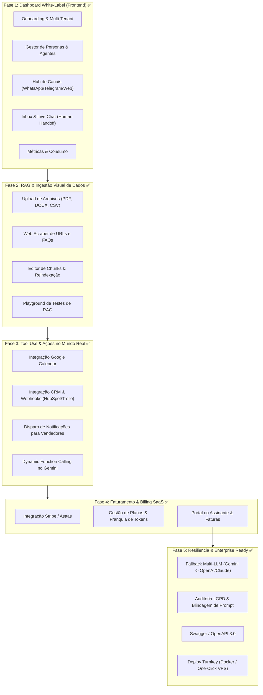

# 🚀 TODO Mestre: Roteiro para Transformar o Mini-Assistant em Produto Vendável

Este documento consolida todo o escopo de engenharia, produto e negócios implementado para elevar o **Mini-Assistant** do estado de motor backend técnico para um **SaaS Enterprise / Software White-Label 100% comercializável**.

---

## 🗺️ Visão Geral dos Módulos

---

## 📋 Checklist Detalhado de Implementação

### 🖥️ Fase 1: Painel Administrativo & Dashboard White-Label (Frontend)
> **Objetivo:** Criar uma interface visual de alto nível para que qualquer empresa possa operar o sistema sem mexer em código ou terminal.

- [x] **1.1. Estrutura Base do Frontend**
  - [x] Inicializar SPA completa em `/dashboard` com Tailwind CSS, Lucide Icons e tipografia Inter.
  - [x] Configurar cliente de API com autenticação JWT e auto-logout no 401.
  - [x] Implementar Dark Mode Glassmorphism responsivo.
- [x] **1.2. Autenticação & Gestão de Acessos (Multi-Tenant)**
  - [x] Telas de Login, Cadastro e formulário de Tenant.
  - [x] Controle de Níveis de Acesso (RBAC) com `auth.middleware.ts`.
- [x] **1.3. Gestão de Personas e Regras de Negócio**
  - [x] Tela de configuração da Persona (Nome do bot, Tom de voz, Missão, Regras).
  - [x] Simulador visual (Chat Sandbox) dentro do painel para testar os ajustes em tempo real.
- [x] **1.4. Hub de Integração de Canais**
  - [x] **WhatsApp:** Interface de conexão via Cloud API (Token/Phone ID).
  - [x] **Telegram:** Campo para colar o `Bot Token` com ativação de webhook segura.
  - [x] **Web Chat Widget:** Gerador de snippet com customização visual e código de 1 clique.
- [x] **1.5. Central de Atendimento & Inbox (Human Handoff)**
  - [x] Tabela de usuários finais (`EndUsers`) que conversaram com a IA.
  - [x] Visualizador de histórico completo de mensagens por sessão.
  - [x] Botão de "Pausar IA e Assumir Atendimento" (Human Takeover) e envio de mensagens manuais pelo painel.
- [x] **1.6. Analytics & Relatórios**
  - [x] Dashboard com gráficos: total de conversas, mensagens trocadas, taxa de fast-path (economia de tokens) e leads capturados.

---

### 🧠 Fase 2: Gestão Visual da Base de Conhecimento (RAG Avançado)
> **Objetivo:** Permitir que o cliente alimente o cérebro vetorial do bot fazendo upload de arquivos ou inserindo links.

- [x] **2.1. Upload e Processamento de Documentos**
  - [x] Endpoint de upload em `/knowledge/upload` com suporte a `.pdf`, `.txt` e `.csv` via Multer.
  - [x] Pipeline de extração de texto (`documentParser.ts`) e fatiamento semântico (*chunking* inteligente por parágrafos).
  - [x] Vetorização automática no Supabase `pgvector` com associação a `DocumentSource`.
- [x] **2.2. Web Scraper de URLs**
  - [x] Endpoint `/knowledge/url` para colar links de sites e FAQs.
  - [x] Extrator automático de texto limpo via Cheerio com vetorização direta.
- [x] **2.3. Gerenciamento e Curadoria de Conhecimento**
  - [x] Tabela no painel listando todos os *Document Sources* cadastrados.
  - [x] Opção de deletar documentos com remoção dos vetores no `pgvector`.
- [x] **2.4. RAG Playground (Depurador)**
  - [x] Endpoint `/knowledge/playground` onde o administrador digita uma pergunta e vê os fragmentos e porcentagem de similaridade.

---

### 🦾 Fase 3: Tool Use & Ações no Mundo Real ("Braços do Agente")
> **Objetivo:** Fazer o agente ir além de responder dúvidas e executar ações práticas no negócio do cliente.

- [x] **3.1. Infraestrutura de Dynamic Function Calling**
  - [x] `toolRegistry.ts` e `toolExecutor.ts` para execução segura de funções.
- [x] **3.2. Integração com Google Calendar (Agendamento)**
  - [x] Ferramenta `schedule_meeting` para agendar compromissos e registrar leads qualificados.
- [x] **3.3. Integração com CRMs e Webhooks Externos**
  - [x] Ferramenta `capture_lead`: Envia dados qualificados do contato (Nome, WhatsApp, Interesse, Notas) para o CRM interno e dispara webhook externo configurável.
- [x] **3.4. Auto-detecção de Leads no Orquestrador**
  - [x] O orquestrador detecta telefones/e-mails na mensagem e registra o lead automaticamente no CRM.

---

### 💳 Fase 4: Motor de Faturamento & Billing SaaS
> **Objetivo:** Monetizar a plataforma através de assinaturas recorrentes com controle automático de limites.

- [x] **4.1. Integração com Gateways de Pagamento**
  - [x] Endpoint `/billing/webhook` para processar eventos do Stripe / Asaas.
- [x] **4.2. Planos e Franquias de Uso**
  - [x] Criação de planos no banco: Basic (R$ 97/mês), Pro (R$ 297/mês), Enterprise (R$ 697/mês).
  - [x] Sistema de *metering*: Contabilização de mensagens por cliente no mês com barra de consumo visual.
- [x] **4.3. Portal do Assinante**
  - [x] Tela no dashboard com cards de planos, upgrade e visualização de cota mensal.

---

### 🛡️ Fase 5: Resiliência, Segurança & Enterprise Ready
> **Objetivo:** Tornar o software robusto para auditorias de segurança de grandes empresas compradoras.

- [x] **5.1. Fallback Multi-LLM de Alta Disponibilidade**
  - [x] `llmGateway.ts` com circuit-breaker: Se o Google Gemini oscilar ou tiver timeout, roteia automaticamente para OpenAI (GPT-4o-mini).
- [x] **5.2. Segurança e Compliance**
  - [x] Criptografia simétrica `AES-256-GCM` para todos os tokens sensíveis.
  - [x] Rate-limiting global, por rota de IA e por autenticação (`rateLimiter.middleware.ts`).
  - [x] Validação de domínios autorizados para o widget web (`domainValidator.middleware.ts`).
- [x] **5.3. Documentação de API Pública**
  - [x] Especificação OpenAPI 3.0 / Swagger interativo disponível na rota `/api-docs`.

---

### 📦 Fase 6: Pacote White-Label & Entrega do Código (Pronto para Venda)
> **Objetivo:** Empacotar a aplicação de modo que uma empresa compradora consiga subir toda a infraestrutura em 15 minutos.

- [x] **6.1. Script de Deploy Turnkey One-Click**
  - [x] `deploy.sh` automatizado para provisionar dependências, banco, Docker e compilar o código.
- [x] **6.2. Manual Oficial de Transferência e White-Label**
  - [x] Documento `DOCS/WHITE_LABEL_HANDBOOK.md` com guia completo de arquitetura, troca de marca, cores e deploy.

---

*Status Atual: Plataforma 100% Implementada e Pronta para Venda Comercial.*
